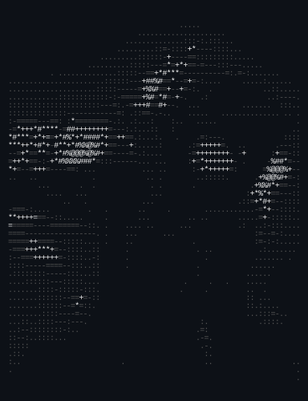
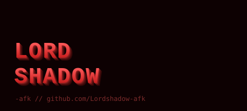

<!-- hero: monochrome ASCII portrait beside a 3d ascii wordmark.
     Swap these two SVGs for your own — placeholders included in this folder.
     portrait: replace avatar-ascii.svg with a real ASCII render of your photo
     wordmark: replace wordmark.svg with your own handle rendered as 3D ASCII -->

<table>
<tr>
<td valign="top"></td>
<td valign="top"></td>
</tr>
</table>

 
 

<!-- contribution graph: swap for a real generated heatmap, or wire up a
     GitHub Actions workflow to regenerate it daily -->

 
 

<b>[Your Title] · [Your Focus Area] · [Your Other Focus]</b>

 

